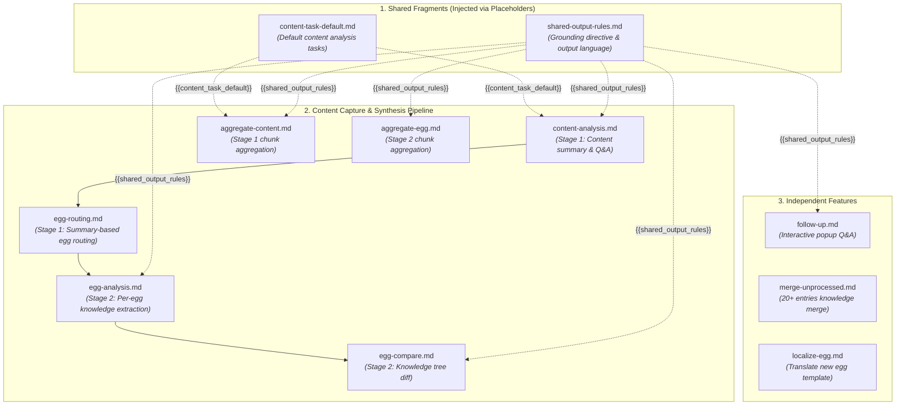

# NutEgg AI Workflow & Prompt Reference

Welcome to the **NutEgg Workflow Engine**. The files in this folder define the prompts, instructions, and schemas that power NutEgg's AI extraction and knowledge synthesis pipeline.

- 🌐 **Chrome Extension:** [NutEgg on Chrome Web Store](https://chromewebstore.google.com/detail/nutegg/bmdmdiicembobejibggoeiahaonphcol)
- 💎 **Obsidian Plugin:** [NutEgg on Obsidian Community Plugins](https://community.obsidian.md/plugins/nutegg)

> [!TIP]
> You can freely edit and customize any file in this directory to tailor NutEgg's analysis to your specific needs (e.g. changing the tone, adding domain-specific perspectives, or adjusting extraction depth).

---

## Architecture Overview

NutEgg uses a **Two-Stage Analysis Architecture** designed for high precision, token efficiency, and user control. Rather than running a monolithic prompt, NutEgg separates broad content understanding from deep, egg-specific knowledge comparison.

```
                    ┌───────────────────────────────┐
                    │      Captured Web Content     │
                    │   (Article / YouTube / Tweet) │
                    └───────────────┬───────────────┘
                                    │
                                    ▼
       ===========================================================
       STAGE 1: Content Analysis & Summary-Based Egg Routing
       ===========================================================
                                    │
                         Is content >30k chars?
                            ├── No  ──► [content-analysis.md]
                            └── Yes ──► Chunks + [aggregate-content.md]
                                    │
                                    ▼
                   Produces: Title Verdict, 3-Bullet Summary,
                   Chapter Map, & Custom Question Answers
                                    │
                                    ▼
                           [egg-routing.md]
           (Routes matched eggs from _index.md using the
            concise Stage 1 summary instead of raw content)
                                    │
                                    ▼
       ===========================================================
       INTERACTIVE CHOICE / EXECUTION MODE (Chrome Extension)
       ===========================================================
                                    │
                        Which mode is selected?
                            │
            ┌───────────────┴───────────────┐
            ▼                               ▼
       [Fast Mode]                 [Confirm Eggs Mode]
       Automatically proceeds      User reviews matched eggs:
       to Stage 2 with all         ├── "Collect Nut Only" (skip Stage 2)
       matched eggs.               └── Add/remove eggs ──► Proceed
            │                               │
            └───────────────┬───────────────┘
                            ▼
       ===========================================================
       STAGE 2: Per-Egg Knowledge Extraction & Novelty Comparison
       ===========================================================
                            │
               For each confirmed egg (1 or N):
                            │
                            ▼
                    [egg-analysis.md]
              (Extract candidate knowledge entries
               & key questions scoped to this egg)
                            │
                            ▼
                    [egg-compare.md]
              (Diffs candidate entries against the
               egg's existing # Knowledge tree to find
               true novel insights & decide read verdict)
                            │
                            ▼
                 Results returned to Popup
                 (Ready to Save Nut & Eggs)
```

> [!NOTE]
> **Why Summary-Based Routing?**
> Passing the Stage 1 summary to `egg-routing.md` instead of full raw articles or multi-hour video transcripts saves tens of thousands of tokens per capture and dramatically improves routing accuracy by focusing on distilled, high-signal semantic themes.

---

### Execution Modes

| Mode | Behavior | Best Used For |
|---|---|---|
| **Fast Mode** | Runs Stage 1 content analysis, routes eggs automatically, and immediately executes Stage 2 knowledge comparison in one uninterrupted pass. | Everyday reading and quick captures when you trust automatic egg matching. |
| **Confirm Eggs Mode** | Runs Stage 1 content analysis, then pauses in the popup. Shows matched eggs alongside your vault's full egg list. You can add/remove eggs, proceed with knowledge comparison, or click **Collect Nut Only** to save the note immediately without comparing against eggs. | Deep research, ambiguous topics, or when you only want a quick summary without updating egg knowledge trees. |

---

### Long Content (>30k Chars) Pipeline

For long articles, papers, or video transcripts (>30k characters), content is automatically split into timestamped or paragraph chunks (<=30k chars each) and aggregated in both stages:

```
  Captured Long Content ──► Split into Chunks (Part 1, Part 2, ... Part N)
                                │
       ┌────────────────────────┴────────────────────────┐
       ▼                                                 ▼
  Stage 1: Content Summary                          Stage 2: Per-Egg Knowledge
  Run [content-analysis.md]                         For each confirmed egg:
  for each chunk                                    Run [egg-analysis.md] + [egg-compare.md]
       │                                            for each chunk
       ▼                                                 │
  [aggregate-content.md]                                 ▼
  Merges chunk summaries into ONE                   [aggregate-egg.md]
  cohesive title verdict, 3-bullet                  Synthesizes cross-part findings
  core summary, and custom Q&A.                     into unified novel delta, answers
       │                                            key questions, & read verdict.
       ▼                                                 │
  [egg-routing.md]                                       │
  (Routes eggs via aggregated summary)                   │
       │                                                 │
       └────────────────────────┬────────────────────────┘
                                │
                                ▼
                    Results returned to Popup
```

---

### Other Workflows (Independent of Capture)

```
  User asks follow-up questions in Chrome popup
     └──► [follow-up.md] (interactive Q&A, 1 AI call per batch)

  Unprocessed entries accumulate in an egg note (20+ threshold or manual button)
     └──► [merge-unprocessed.md] (merge into # Knowledge tree, 1 AI call)

  User creates a new egg with a non-English description
     └──► [localize-egg.md] (translate egg template, 1 AI call)
```

---

## Prompt Dependency & Injection Map

Some prompt files are **shared fragments** that are not executed independently, but are injected into other prompts via `{{placeholder}}` variables at runtime:



---

## Anatomy of an Egg File & How Instructions Work

An **Egg file** (`nutegg/*.md`) is both a curated knowledge repository and an instruction manual that guides NutEgg's AI pipeline whenever content touches that domain.

### 1. Structural Blueprint

```markdown
---
topic: "AI Architecture & Multi-Agent Systems"
status: "active"
last_updated: "2026-09-10"
language: "English"
---

> [!abstract]- Instructions:
> **Scope:** Multi-agent architectures, tool calling, memory layers, and LLM evaluation.
> **Action Guide:** Focus on actionable design patterns, scalability tradeoffs, and real failure modes.
> **Key Questions:**
> 1. How are agent memory loops bounded to prevent context window overflow?
> 2. What coordination mechanism is used between subagents?
> **Rejection Criteria:**
> - Ignore basic beginner tutorials or high-level sales pitches without technical substance.
> - Discard speculative claims lacking empirical benchmarks or code evidence.
> **Formatting Rules:**
> - Prefix each insight with a bracketed tag: `[concept]`, `[architecture]`, `[method]`, `[benchmark]`, `[explain]`, `[fact]`, `[example]`.
> - Use the structure: `- [tag] **Concept Name**` followed by an indented explanation and concrete examples (`- 🎯 Example:`).

# Knowledge
## Agent Memory
- [architecture] **Bounded Replay Buffers**
    - Ephemeral short-term memory expires after session goals terminate to conserve token budget.
    - 🎯 Example: Tool calling trace logs stored in vector stores with sliding window eviction.

# Unprocessed
(Newly hatched insights land here from captures until auto-merged)
```

### 2. How to Write Egg Instructions

Each field in the `> [!abstract]- Instructions:` callout controls a specific behavior in the AI workflow:

| Field | Purpose & Best Practices | Workflow Usage |
|---|---|---|
| **`**Scope:**`** | 1–2 sentences defining the topical boundaries of this egg. Specify what technologies, domains, or concepts are included and excluded. | Injected into [`egg-analysis.md`](./egg-analysis.md) (Stage 2) so the AI extracts knowledge through this domain lens. |
| **`**Action Guide:**`** | 2-step instructions for Stage 2 egg analysis: Step 1 (Novel Delta: extract only genuinely new insights) and Step 2 (Decide: whether user should spend time reading). | Injected into [`egg-analysis.md`](./egg-analysis.md) and [`egg-compare.md`](./egg-compare.md) (Stage 2). |
| **`**Key Questions:**`** | Numbered list of recurring questions you want answered whenever content touches this domain (e.g. *"What are the hidden tradeoffs?", "What is the token cost?"*). | Injected into [`egg-analysis.md`](./egg-analysis.md) (Stage 2). Answered in the popup and raw capture notes. |
| **`**Rejection Criteria:**`** | Bulleted list of low-signal filters (e.g. *"Ignore beginner tutorials", "Reject speculative price talk"*). | Injected into [`egg-compare.md`](./egg-compare.md) (Stage 2). If matched, flags `rejected: true`, sets `readVerdict: false`, and gives a skip reason. |
| **`**Formatting Rules:**`** | Standards for phrasing, tags (`[concept]`, `[architecture]`, `[method]`, etc.), and hierarchical indentation. | Injected into [`egg-analysis.md`](./egg-analysis.md) (Stage 2). Guarantees candidate entries match your notes' formatting. |

### 3. Knowledge Tree vs. Unprocessed Queue

- **`# Knowledge` (Curated Knowledge Tree)**:
  - Structured with markdown headings (`##`, `###`) and indented bullet points.
  - Injected as `{{knowledge_tree}}` into [`egg-compare.md`](./egg-compare.md) (Stage 2). The AI compares extracted candidate insights against this tree to filter out redundant concepts and surface only true **Novel Delta**.
- **`# Unprocessed` (Staging Queue)**:
  - When you click **🥚 Hatch Egg** in the browser, fresh insights are safely appended to `# Unprocessed` first. This prevents AI runs from corrupting your curated knowledge tree.
  - When 20+ entries accumulate (or when you click **Merge** in the Obsidian reading view widget), [`merge-unprocessed.md`](./merge-unprocessed.md) runs automatically to deduplicate and nest pending entries under appropriate parent concepts in `# Knowledge`.

### 4. End-to-End Workflow Mapping

```
                                  [Captured Web Content]
                                            │
               Stage 1: Content Analysis    ▼    _index.md (Topic routing guide)
               ─────────────────────────────────────────────────────────────
               • Uses content-task-default.md (fixed content tasks)
               • Generates Title Verdict, 3-Bullet Summary, Chapter Map
               • egg-routing.md matches egg descriptions via Stage 1 summary
                                            │
                                            ▼
               Interactive Review: User confirms or selects target eggs
                                            │
               Stage 2: Per-Egg Deep Dive   ▼    Target Egg File (nutegg/*.md)
               ─────────────────────────────────────────────────────────────
               • Scope, Key Questions, Formatting Rules ──► egg-analysis.md
                 (Extracts candidate knowledge entries and answers questions)
               • Rejection Criteria, # Knowledge Tree ──► egg-compare.md
                 (Diffs candidates against existing tree, drops redundant entries)
                                            │
                                            ▼
               Hatch Egg: Confirmed novel entries appended to # Unprocessed
                                            │
               Merge Cycle (20+ entries or button click)
               ─────────────────────────────────────────────────────────────
               • merge-unprocessed.md nests and integrates entries into # Knowledge
```

---

## Workflow File Directory

### 1. Shared Fragments

These are **not standalone prompts** — they are modular snippets injected as `{{placeholders}}` into other prompts.

| File | Injected As | Injected Into | Purpose |
|---|---|---|---|
| [`shared-output-rules.md`](./shared-output-rules.md) | `{{shared_output_rules}}` | `content-analysis`, `egg-analysis`, `egg-compare`, `aggregate-content`, `aggregate-egg`, `follow-up` | Combined grounding directive (content as sole truth) and multi-lingual output language reference rule. |
| [`content-task-default.md`](./content-task-default.md) | `{{content_task_default}}` | `content-analysis`, `aggregate-content` | Default fixed tasks for content analysis: Title Verdict, 3-Bullet Core Summary, and Chapter Map. |

### 2. Content Capture Pipeline

| File | Pipeline Stage | Purpose | Output Format |
|---|---|---|---|
| [`content-analysis.md`](./content-analysis.md) | Stage 1: Content Analysis | Content-level summary: title verdict, 3-bullet summary, chapter map, and custom user question answers. | JSON (`titleVerdict`, `coreSummary`, `isLongForm`, `chapterMap`, `customQuestionAnswers`) |
| [`egg-routing.md`](./egg-routing.md) | Stage 1: Summary-Based Routing | Matches the Stage 1 content summary against egg descriptions in `_index.md` to select matching eggs with minimal tokens. | Plain text list of filenames (one per line) |
| [`egg-analysis.md`](./egg-analysis.md) | Stage 2: Egg Extraction | Per-egg extraction: candidate knowledge entries and key question answers scoped strictly to one egg's instructions. | JSON (`keyQuestionAnswers`, `extractedEntries`) |
| [`egg-compare.md`](./egg-compare.md) | Stage 2: Knowledge Diff | Diffs candidate entries against the egg's existing `# Knowledge` tree and `# Unprocessed` to find novel insights and determine read verdict. | JSON (`novelDelta`, `redundantEntries`, `rejected`, `rejectReason`, `readVerdict`, `readVerdictReason`) |

### 3. Long Content Aggregation

Used only when content exceeds ~30k characters (long articles, 1-2 hour videos). Each chunk is processed through extraction first, then these prompts synthesize the per-chunk results.

| File | Pipeline Stage | Purpose | Output Format |
|---|---|---|---|
| [`aggregate-content.md`](./aggregate-content.md) | Stage 1 Aggregation | Merges per-chunk summaries into one cohesive title verdict, core summary, and user Q&A for the whole content. | JSON (`titleVerdict`, `coreSummary`, `customQuestionAnswers`) |
| [`aggregate-egg.md`](./aggregate-egg.md) | Stage 2 Aggregation | Synthesizes per-chunk findings into unified knowledge entries, key question answers, and read verdict for each egg. | JSON (`novelDelta`, `keyQuestionAnswers`, `rejected`, `rejectReason`, `readVerdict`, `readVerdictReason`) |

### 4. Independent Features

| File | Trigger | Purpose | Output Format |
|---|---|---|---|
| [`follow-up.md`](./follow-up.md) | User asks questions in Chrome popup | Answers follow-up questions about the captured content with conversation history context. | JSON (`answers`: `[{"question", "answer"}]`) |
| [`merge-unprocessed.md`](./merge-unprocessed.md) | Manual button or 20+ entries threshold | Deduplicates and nests accumulated `# Unprocessed` entries into the structured `# Knowledge` tree. | JSON (`knowledge`, `unprocessed`) |
| [`localize-egg.md`](./localize-egg.md) | New egg with non-English description | Translates the egg template into the language of the egg's description while keeping parser-critical headings in English. | Full egg note (Markdown) |

---

## Customization Rules & Guidelines

### ✅ What You Can Safely Customize
- **Tone and Perspective**: You can instruct the AI to be more critical, more technical, or focus on specific themes.
- **Summary Depth**: You can change how concise or detailed summaries should be.
- **Language / Idiom Preferences**: You can tweak phrasing, formatting preferences, or custom analytical lenses.
- **Shared Output Rules**: Edit `shared-output-rules.md` to adjust how strictly the AI stays grounded to the source content or handles output languages across all prompts.

### ⚠️ What You Must Preserve (To Prevent Parser Errors)
1. **`{{placeholders}}`**: The strings enclosed in double curly braces (e.g. `{{content}}`, `{{egg_description}}`, `{{knowledge_tree}}`) are replaced dynamically by the engine. Do not delete or rename them.
2. **JSON Schemas**: Prompts that output JSON must keep the exact JSON key names specified in the template. The TypeScript engine parses these exact keys.
3. **Markdown Structural Headings**: In prompts that output markdown (`localize-egg.md`), structural labels and headings like `# Knowledge` and `# Unprocessed` must remain verbatim in English for the note parser.

---

## Updates & Conflict Resolution

When NutEgg updates to a newer version:
- **If you haven't edited a workflow file**: The plugin automatically updates it to the latest version.
- **If you have customized a workflow file**: NutEgg will **never overwrite your custom version**. Instead, it writes `[filename].new.md` alongside your file so you can inspect what changed in the update.
- **Obsolete prompt cleanup**: Any unedited prompt files that were removed in a newer release of NutEgg are automatically pruned so your `_workflow/` folder stays clean.
- **Use Defaults (Clean Reset)**: You can reset all workflow files back to factory defaults at any time from `Obsidian Settings → NutEgg → Use Default Workflow Prompts` by clicking **Use Defaults**. This safely moves all your existing files to a timestamped backup folder (`_workflow/_backup/<timestamp>/`), clears obsolete files, and restores clean built-in defaults.
