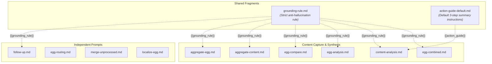

# NutEgg AI Workflow & Prompt Reference

Welcome to the **NutEgg Workflow Engine**. The files in this folder define the prompts, instructions, and schemas that power NutEgg's AI extraction and knowledge synthesis pipeline.

> [!TIP]
> You can freely edit and customize any file in this directory to tailor NutEgg's analysis to your specific needs (e.g. changing the tone, adding domain-specific perspectives, or adjusting extraction depth).

---

## Architecture Overview

When you capture an article, video, or note in NutEgg, the AI processor selects a pipeline based on how many eggs match and whether the content is long (>30k characters):

```
                  ┌───────────────────────────────┐
                  │      Captured Web Content     │
                  │   (Article / YouTube / Tweet) │
                  └──────────────┬────────────────┘
                                 │
                 Did the user manually pick eggs?
                    ├── No ──► [egg-routing.md] ──► match eggs from _index.md
                    └── Yes ─► use selected eggs
                                 │
                      Is content long (>30k chars)?
                         ├── Yes ──► (see Long Content Pipeline below)
                         └── No──┐
                                 │
                  ┌──────────────┴──────────────┐
                  │                             │
             1 egg matched              2+ eggs matched
                  │                             │
        ┌─────────┴──────────┐     ┌────────────┴──────────┐
        │  [egg-combined.md] │     │ [content-analysis.md] │
        │  (summary + extract│     │ (summary & chapter    │
        │   in 1 AI call)    │     │  map, 1 AI call)      │
        └────────┬───────────┘     └────────────┬──────────┘
                 │                              │
                 │                    ┌─────────┴──────────┐
                 │                    │  [egg-analysis.md] │
                 │                    │  (per-egg extract, │
                 │                    │   N parallel calls)│
                 │                    └─────────┬──────────┘
                 │                              │
                 └──────────┬───────────────────┘
                            │
                   [egg-compare.md]
                   (diff candidate insights against
                    existing knowledge tree, 1 AI call per egg)
                            │
                            ▼
                Results returned to Popup
```

### Long Content (>30k Chars) Pipeline

For long articles or video transcripts, content is split into timestamped or paragraph chunks (<= 30k chars). NutEgg processes each chunk through extraction and then synthesizes the whole:

```
  Captured Long Content ──► Split into Chunks (Part 1, Part 2, ... Part N)
                                │
       ┌────────────────────────┴────────────────────────┐
       ▼                                                 ▼
  Phase 1: Content Summary                          Phase 2: Per-Egg Knowledge
  Run [content-analysis.md]                         For each egg:
  for each chunk                                    Run [egg-analysis.md] + [egg-compare.md]
       │                                            for each chunk
       ▼                                                 │
  [aggregate-content.md]                                 ▼
  Merges chunk summaries into ONE                   [aggregate-egg.md]
  cohesive title verdict, 3-bullet                  Synthesizes cross-part findings
  core summary, and answers to user                 into unified novel delta, answers
  custom questions. (1 AI call)                     key questions, & read verdict. (1 AI call/egg)
       │                                                 │
       └────────────────────────┬────────────────────────┘
                                │
                                ▼
                    Results returned to Popup
```

### Other Workflows (Independent of Capture)

```
  User asks follow-up questions in Chrome popup
     └──► [follow-up.md] (interactive Q&A, 1 AI call per batch)

  Unprocessed entries accumulate in an egg note (20+ threshold or manual button)
     └──► [merge-unprocessed.md] (merge into # Knowledge tree, 1 AI call)

  User creates a new egg with a non-English description
     └──► [localize-egg.md] (translate egg template, 1 AI call)
```

---

## Prompt Dependency & Injection Map

Some prompt files are **shared fragments** that are not executed independently, but are injected into other prompts via `{{placeholder}}` variables at runtime:



---

## Workflow File Directory

### 1. Shared Fragments

These are **not standalone prompts** — they are modular snippets injected as `{{placeholders}}` into other prompts.

| File | Injected As | Injected Into | Purpose |
|---|---|---|---|
| [`grounding-rule.md`](./grounding-rule.md) | `{{grounding_rule}}` | `egg-combined`, `content-analysis`, `egg-analysis`, `egg-compare`, `aggregate-content`, `aggregate-egg`, `follow-up` | Strict anti-hallucination directive: *"The content is the ONLY source of truth... never supplement with outside knowledge."* |
| [`action-guide-default.md`](./action-guide-default.md) | `{{action_guide}}` | `content-analysis` | Baseline Action Guide (Verdict, 3 bullets, Chapter map) used when an egg note does not specify its own. |

### 2. Content Capture Pipeline

| File | Pipeline Stage | Purpose | Output Format |
|---|---|---|---|
| [`egg-routing.md`](./egg-routing.md) | Routing | Compares content against egg descriptions in `_index.md` to select matching eggs. | Plain text list of filenames (one per line) |
| [`egg-combined.md`](./egg-combined.md) | Single-Egg Fast Path | Combined 1-call prompt: content summary + chapter map + candidate knowledge entries for a single egg. | JSON (`titleVerdict`, `coreSummary`, `chapterMap`, `customQuestionAnswers`, `keyQuestionAnswers`, `extractedEntries`) |
| [`content-analysis.md`](./content-analysis.md) | Multi-Egg Step 1 | Content-level summary: title verdict, core summary, chapter map, and user question answers (shared across all eggs). | JSON (`titleVerdict`, `coreSummary`, `isLongForm`, `chapterMap`, `customQuestionAnswers`) |
| [`egg-analysis.md`](./egg-analysis.md) | Multi-Egg Step 2 | Per-egg extraction: candidate knowledge entries and key question answers scoped to one egg's instructions. | JSON (`keyQuestionAnswers`, `extractedEntries`) |
| [`egg-compare.md`](./egg-compare.md) | Knowledge Diff (All Paths) | Diffs candidate entries against the egg's existing `# Knowledge` tree and `# Unprocessed` to find novel insights and decide read verdict. | JSON (`novelDelta`, `redundantEntries`, `rejected`, `rejectReason`, `readVerdict`, `readVerdictReason`) |

### 3. Long Content Aggregation

Used only when content exceeds ~30k characters (long articles, 1-2 hour videos). Each chunk is processed through extraction first, then these prompts synthesize the per-chunk results.

| File | Pipeline Stage | Purpose | Output Format |
|---|---|---|---|
| [`aggregate-content.md`](./aggregate-content.md) | Long Content Phase 1 | Merges per-chunk summaries into one cohesive title verdict, core summary, and user Q&A for the whole content. | JSON (`titleVerdict`, `coreSummary`, `customQuestionAnswers`) |
| [`aggregate-egg.md`](./aggregate-egg.md) | Long Content Phase 2 | Synthesizes per-chunk findings into unified knowledge entries, key question answers, and read verdict for each egg. | JSON (`novelDelta`, `keyQuestionAnswers`, `rejected`, `rejectReason`, `readVerdict`, `readVerdictReason`) |

### 4. Independent Features

| File | Trigger | Purpose | Output Format |
|---|---|---|---|
| [`follow-up.md`](./follow-up.md) | User asks questions in Chrome popup | Answers follow-up questions about the captured content with conversation history context. | JSON (`answers`: `[{"question", "answer"}]`) |
| [`merge-unprocessed.md`](./merge-unprocessed.md) | Manual button or 20+ entries threshold | Deduplicates and nests accumulated `# Unprocessed` entries into the structured `# Knowledge` tree. | JSON (`knowledge`, `unprocessed`) |
| [`localize-egg.md`](./localize-egg.md) | New egg with non-English description | Translates the egg template into the language of the egg's description while keeping parser-critical headings in English. | Full egg note (Markdown) |

---

## Customization Rules & Guidelines

### ✅ What You Can Safely Customize
- **Tone and Perspective**: You can instruct the AI to be more critical, more technical, or focus on specific themes.
- **Summary Depth**: You can change how concise or detailed summaries should be.
- **Language / Idiom Preferences**: You can tweak phrasing, formatting preferences, or custom analytical lenses.
- **Grounding Rule**: Edit `grounding-rule.md` to adjust how strictly the AI stays grounded to the source content. The change automatically applies to all 7 prompts that use `{{grounding_rule}}`.

### ⚠️ What You Must Preserve (To Prevent Parser Errors)
1. **`{{placeholders}}`**: The strings enclosed in double curly braces (e.g. `{{content}}`, `{{egg_description}}`, `{{knowledge_tree}}`) are replaced dynamically by the engine. Do not delete or rename them.
2. **JSON Schemas**: Prompts that output JSON must keep the exact JSON key names specified in the template. The TypeScript engine parses these exact keys.
3. **Markdown Structural Headings**: In prompts that output markdown (`localize-egg.md`), structural labels and headings like `# Knowledge` and `# Unprocessed` must remain verbatim in English for the note parser.

---

## Updates & Conflict Resolution

When NutEgg updates to a newer version:
- **If you haven't edited a workflow file**: The plugin automatically updates it to the latest version.
- **If you have customized a workflow file**: NutEgg will **never overwrite your custom version**. Instead, it writes `[filename].new.md` alongside your file so you can inspect what changed in the update.
- **Restore Defaults**: You can reset all workflow files back to factory defaults at any time from `Obsidian Settings → NutEgg → Restore Default Workflow Files`.
